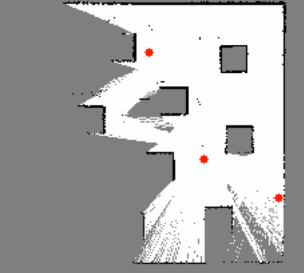

# Thesis

Notes

ROS2Swarm
    bash start_simulation.sh
    bash start_command.sh
Thesis_ws
    bash slam.sh
    
rqt_graph

Turtlebot3
    Cartographer
        Algorithm Walkthrouh
            - https://google-cartographer-ros.readthedocs.io/en/latest/algo_walkthrough.html

bash x2

ros2 launch merge_map map_view_launch.py number_robots:=3
ros2 launch swarm_slam nav2.launch.py number_robots:=3
ros2 launch swarm_slam explore.launch.py number_robots:=3

